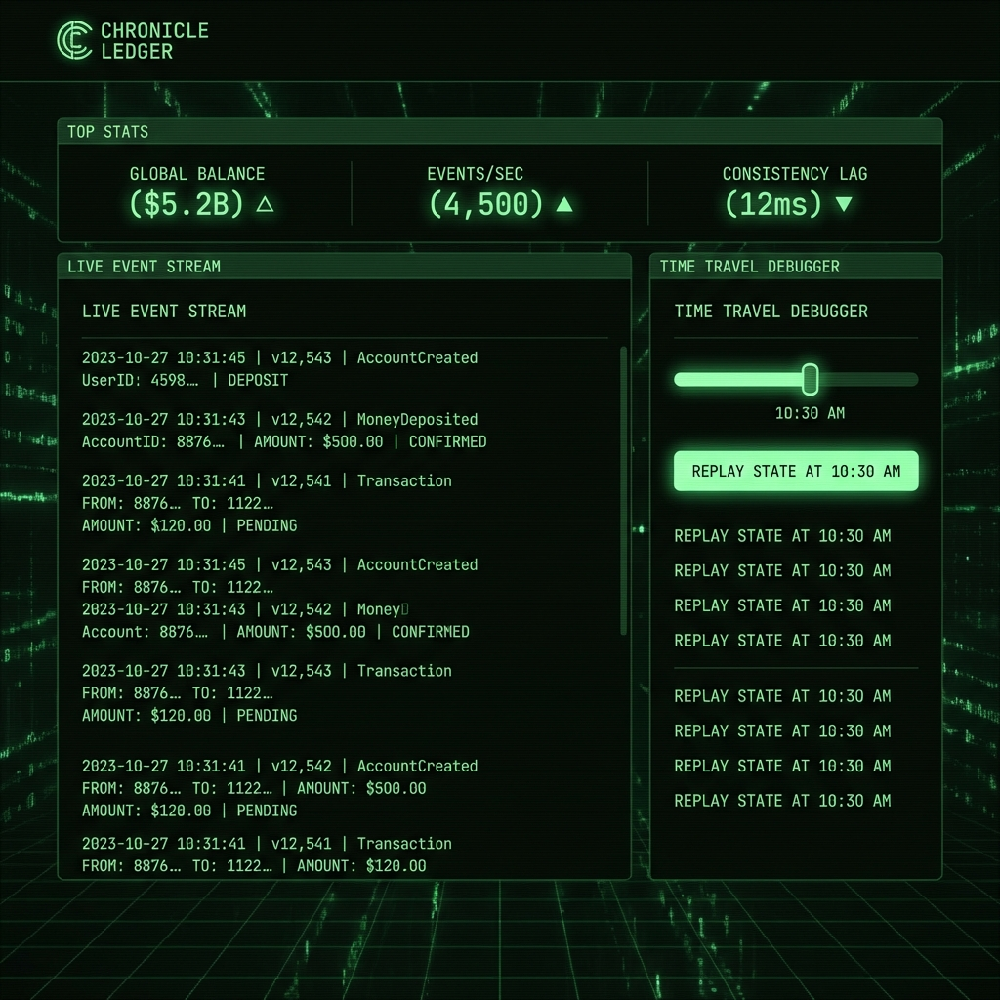
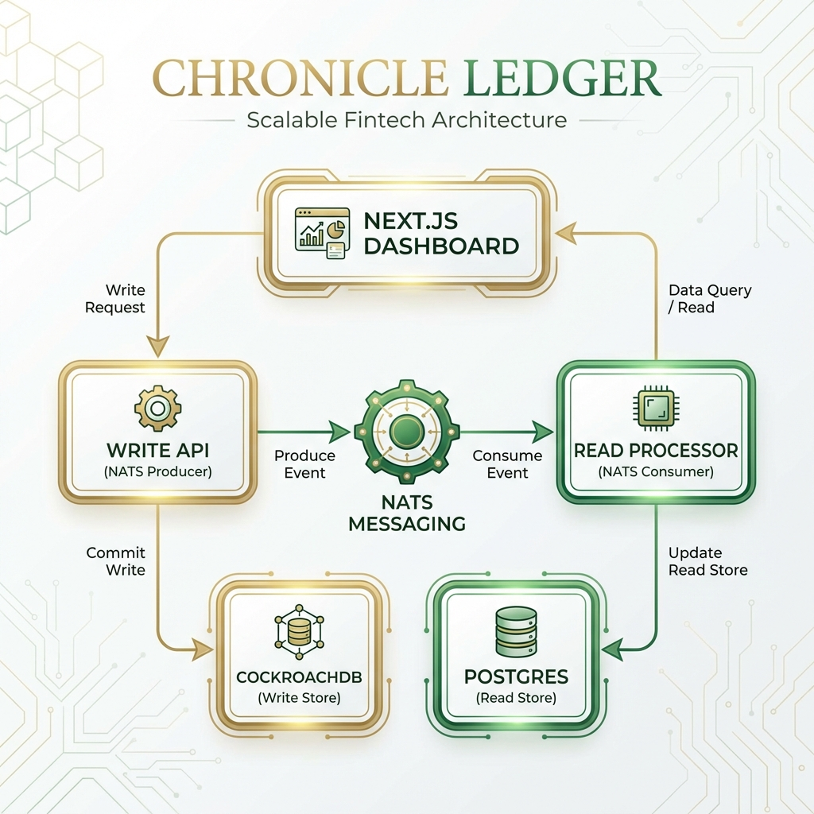
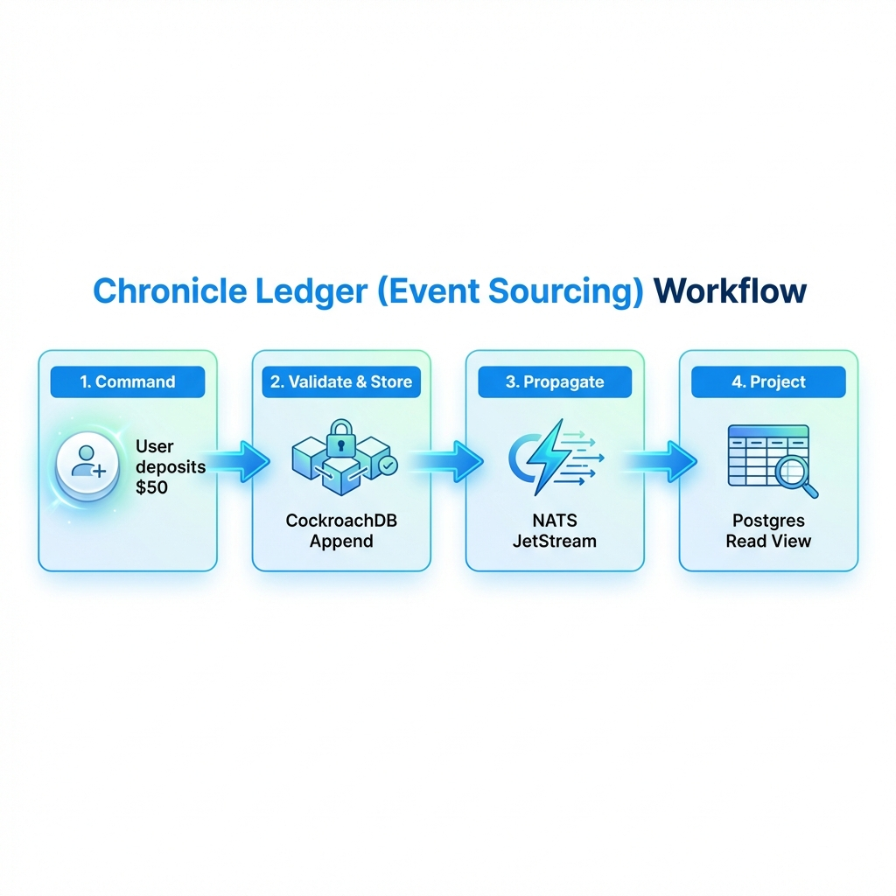

# Chronicle Ledger


## Modern Event-Sourced Banking System with CQRS & CockroachDB

<div align="center">


</div>

**Chronicle Ledger** is a financial auditing system that prioritizes data integrity above all else. By using **Event Sourcing**, it ensures that no financial state is ever overwritten; instead, every transaction is stored as an immutable event. It implements **CQRS** to separate high-throughput writes (CockroachDB) from lightning-fast reads (PostgreSQL), bridged by **NATS JetStream**.

---

## 🚀 Quick Start

Run the entire distributed ledger (DBs + Bus + APIs) in 2 steps:

```bash
# 1. Start Infrastructure
docker-compose up -d

# 2. Start Application Services
npm install && npm run dev
```

> **Detailed Setup**: See [GETTING_STARTED.md](./docs/GETTING_STARTED.md).

---

## 📸 Demo & Architecture

### Real-Time Auditor Dashboard

*Live event log streaming and account materialization.*

### System Architecture

*CQRS Split: Write API (Event Store) -> NATS -> Read Processor -> Projected View.*

### Transaction Workflow

*Step-by-step: Command validation, Event persistence, and View migration.*

> **Deep Dive**: See [ARCHITECTURE.md](./docs/ARCHITECTURE.md) for Causal Consistency and Schema details.

---

## ✨ Key Features

*   **📜 Immutable Event Log**: Uses **CockroachDB** to store append-only financial records.
*   **⚡ CQRS Implementation**: Completely decouples Write Scaling from Read Performance.
*   **⏰ Time-Travel Debugging**: Ability to query account state at any historical microsecond.
*   **🛡️ Double-Spend Protection**: Optimistic Concurrency Control (OCC) at the event layer.
*   **🌊 Async Projection**: NATS JetStream ensures the Read side stays eventually consistent with 100% RELIABILITY.

---

## 🏗️ The Protective Journey

How a simple deposit becomes an unhackable record:

1.  **Command**: User submits "Deposit $100" via the Write API.
2.  **Verify**: API validates current version (Concurrency check).
3.  **Persist**: The "Deposited" event is committed to the CockroachDB Event Store.
4.  **Publish**: NATS JetStream picks up the new event and broadcasts it.
5.  **Project**: The Read Processor consumes the event and updates the PostgreSQL Materialized View.
6.  **Query**: The user sees their updated balance instantly via the Query API.

---

## 📚 Documentation

| Document | Description |
| :--- | :--- |
| [**System Architecture**](./docs/ARCHITECTURE.md) | Event Schemas, NATS topology, and CQRS trade-offs. |
| [**Getting Started**](./docs/GETTING_STARTED.md) | Docker environment, DB init, and Load tests. |
| [**Failure Scenarios**](./docs/FAILURE_SCENARIOS.md) | Handling "Offline Processors" and NATS persistence. |
| [**Interview Q&A**](./docs/INTERVIEW_QA.md) | "Event Sourcing vs CRUD", "Why CockroachDB?". |

---

## 🔧 Tech Stack

| Component | Technology | Role |
| :--- | :--- | :--- |
| **Write Store** | **CockroachDB** | Distributed, Immutable Event Log. |
| **Read Store** | **PostgreSQL** | High-performance Projected Views. |
| **Messaging** | **NATS JetStream**| Resilient Async Event Bus. |
| **Frontend** | **Next.js 14** | Real-time Audit & Visualization. |

---

## 👤 Author

**Harshan Aiyappa**  
Senior Full-Stack Hybrid AI Engineer  
Voice AI • Distributed Systems • Infrastructure

[](https://kimo-nexus.vercel.app/)
[](https://github.com/Kimosabey)
[](https://linkedin.com/in/harshan-aiyappa)
[](https://x.com/HarshanAiyappa)

---

## 📝 License

This project is licensed under the MIT License - see the [LICENSE](LICENSE) file for details.
