# 🏗️ System Architecture

## 1. High-Level Design (HLD)

Chronicle Ledger is a **Banking-Grade Financial System** built on **Event Sourcing** and **CQRS (Command Query Responsibility Segregation)** principals. Unlike traditional ledgers that store only the *current balance*, Chronicle Ledger stores every single transaction as an immutable event.

```mermaid
graph TD
    %% Zones
    subgraph "Write Side (Command)"
        Client("👤 User") -->|POST /deposit| WriteAPI("⚡ Write API")
        WriteAPI -->|1. Append Event| EventStore[("🪳 CockroachDB (Event Store)")]
        EventStore -->|2. Stream| NATS("📨 NATS JetStream")
    end

    subgraph "Read Side (Query)"
        NATS -->|3. Consume| Processor("⚙️ Projection Worker")
        Processor -->|4. Update State| ReadDB[("🐘 PostgreSQL (Read Model)")]
        Client -.->|GET /balance| QueryAPI("🔍 Query API")
        QueryAPI -.->|Select| ReadDB
    end

    %% Flows
    subgraph "Time Travel"
        Client -.->|GET /balance?time=T| QueryAPI
        QueryAPI -.->|Replay Events| EventStore
    end

    %% Styling
    style EventStore fill:#f9f,stroke:#333
    style ReadDB fill:#9f9,stroke:#333
    style NATS fill:#ff9,stroke:#333
```



### Core Components
1.  **Write API (Command)**: Accepts transactions (Deposit, Withdraw). It validates business rules against the *current state* derived from events, then appends a new event.
2.  **Event Store (CockroachDB)**: The Single Source of Truth. An append-only log of `AccountCreated`, `MoneyDeposited`, `MoneyWithdrawn` events.
3.  **Message Bus (NATS)**: Publishes events to subscribers. Ensures decoupling.
4.  **Projection Worker**: Listens to events and updates the "Read Model". E.g., `MoneyDeposited($50)` -> `UPDATE accounts SET balance = balance + 50`.
5.  **Read API (Query)**: Serves fast, pre-calculated data from PostgreSQL.

---

## 2. Low-Level Design (LLD)

### Event Schema (Immutable)
Every change is defined as a JSON Event.
```typescript
interface Event {
  id: string;          // Global Event ID
  aggregateId: string; // Account ID (e.g., ACC-123)
  type: "MONEY_DEPOSITED" | "MONEY_WITHDRAWN" | "ACCOUNT_CREATED";
  data: {
    amount: number;
    currency: string;
    reason?: string;
  };
  timestamp: string;
  version: number;     // Optimistic Locking version
}
```

### Database Schema

**1. Event Store (CockroachDB)**
*   Table: `events`
*   PK: `(aggregate_id, version)` -> Ensures no two events can claim the same version (Concurrency Control).

**2. Read Model (PostgreSQL)**
*   Table: `accounts` (`id`, `balance`, `owner`)
*   Table: `transactions` (`id`, `account_id`, `amount`, `type`, `date`)

---

## 3. Decision Log

| Decision | Alternative | Reason for Choice |
| :--- | :--- | :--- |
| **Event Sourcing** | CRUD (Current State) | **Auditability**. Banks need to know *why* a balance is $100. CRUD overwrites history; Event Sourcing keeps it forever. |
| **CockroachDB** | PostgreSQL | **High Availability**. For the Write Log, we need a distributed SQL database that can survive node failures without data loss. |
| **CQRS** | Monolith API | **Scale**. Read traffic (Viewing Balance) is 100x higher than Write traffic. CQRS allows us to scale the Read API independently. |
| **NATS** | Kafka | **Simplicity**. NATS JetStream is lighter than Kafka and perfect for internal microservice event distribution. |

---

## 4. Key Patterns

### Time Travel Queries
Because we have the full history of events, we can answer questions like *"What was my balance on Jan 1st?"*.
*   **Logic**: Fetch all events for `Account X` where `timestamp <= Jan 1`. Replay them in memory. Return result.

### Optimistic Concurrency Control (OCC)
To prevent "Double Spending":
1.  Read current version (v5).
2.  Calculate new balance.
3.  Attempt to write `Event v6`.
4.  If DB says "v6 already exists" (someone else spent money), Fail and Retry.
